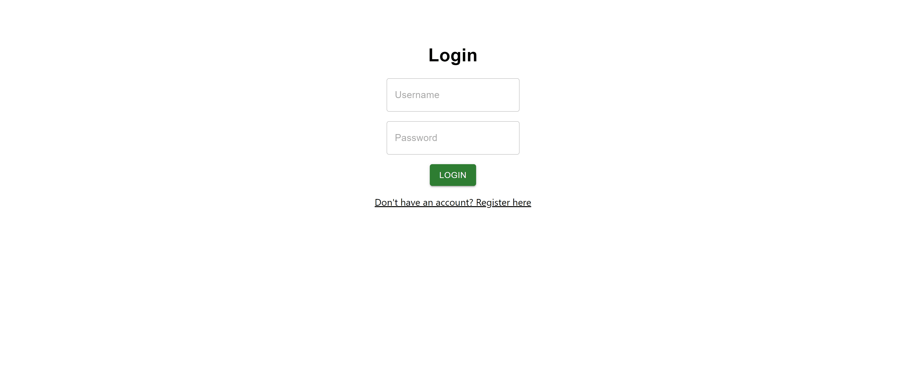

# todolist
## MERN Stack TodoList App



### Overview

This MERN (MongoDB, Express.js, React.js, Node.js) stack TodoList application allows users to efficiently manage their tasks. Users can create an account, log in, create new todos, update them, and mark them as complete or incomplete. JSON Web Tokens (JWT) are utilized for authentication and authorization. The frontend is developed with Create React App and enhanced with Material-UI components.

### Technologies Used

#### Frontend

- **React.js**: A popular JavaScript library for building user interfaces. React allows for the creation of reusable UI components.
  
- **Create React App**: A convenient tool that sets up a new React project with a sensible default configuration. It includes a development server, build scripts, and other necessary tools.

- **Material-UI**: A React component library that implements Google's Material Design. Material-UI provides a set of high-quality React components that work out of the box.

#### Backend

- **Node.js**: A JavaScript runtime built on Chrome's V8 JavaScript engine. Node.js enables server-side scripting and allows for the development of scalable network applications.

- **Express.js**: A minimal and flexible Node.js web application framework that provides robust features for web and mobile applications. Express.js simplifies the process of building APIs and handling HTTP requests.

- **MongoDB**: A NoSQL database that stores data in JSON-like documents. MongoDB is known for its flexibility and scalability, making it a popular choice for modern web applications.

- **JWT (JSON Web Tokens)**: A compact, URL-safe token format that securely encodes JSON data. JWTs are used for authentication and information exchange between parties, ensuring data integrity and authenticity.

### Features

- **User Authentication**: Users can sign up and log in securely using JWT tokens for authentication.

- **Todo Management**: Authenticated users can create new todos, update their descriptions, and mark them as complete or incomplete.

- **Responsive UI**: The frontend is designed to be responsive, ensuring a seamless user experience across various devices and screen sizes.

### Setup Instructions

1. **Clone the Repository**

    ```
    git clone <repository-url>
    cd todolist
    ```

2. **Install Dependencies**

    - For the client (frontend):

        ```
        cd client
        npm install
        ```

    - For the server (backend):

        ```
        cd server
        npm install
        ```

3. **Configure MongoDB**

    - In the `server/index.js` file, update the `mongodbURI` variable with your MongoDB database URL.

4. **Run the Application**

    - For the client (frontend):

        ```
        cd client
        npm run start
        ```

        The client will run on `http://localhost:3000`.

    - For the server (backend):

        ```
        cd server
        npm run nodemon
        ```

        The server will run on `http://localhost:3001`.


      ## Authentication using JSON Web Tokens (JWT)

In this MERN stack TodoList application, JSON Web Tokens (JWT) are employed for user authentication. Here's a simplified explanation of the authentication process:

### Signup:

1. **User Registration:**
   - User signs up with a unique username and password.

2. **Token Creation:**
   - Upon successful registration, the server generates a JWT token.
   - User data (e.g., username) is encoded into the token.

3. **Token Sent to Client:**
   - The server sends the JWT token back to the client.

### Login:

1. **User Login:**
   - User provides credentials (username and password).

2. **Token Verification:**
   - Server verifies the received JWT token.
   - If valid, the server extracts user data from the token.

3. **User Verification:**
   - Server validates the user using extracted data.
   - If successful, the user is authenticated.

### Benefits of JWT Authentication:

- **Stateless**: JWTs are stateless, eliminating the need for server-side session storage.

- **Security**: JWTs are cryptographically signed, ensuring data integrity and authenticity.

- **Efficiency**: Compact and easily transmitted as HTTP headers or URL parameters.

By leveraging JWTs, this TodoList application ensures secure and efficient user authentication.

---


